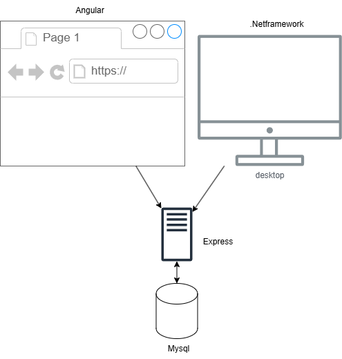
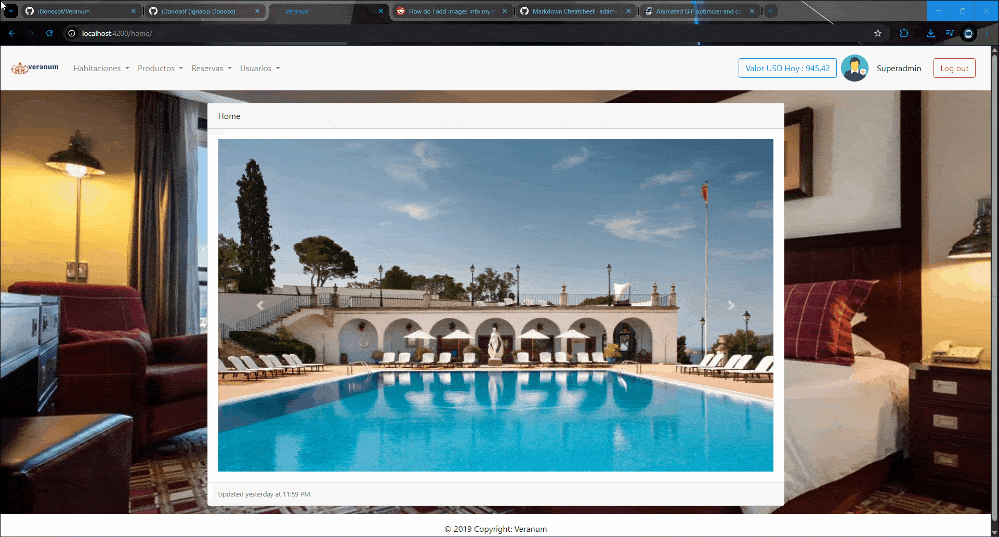
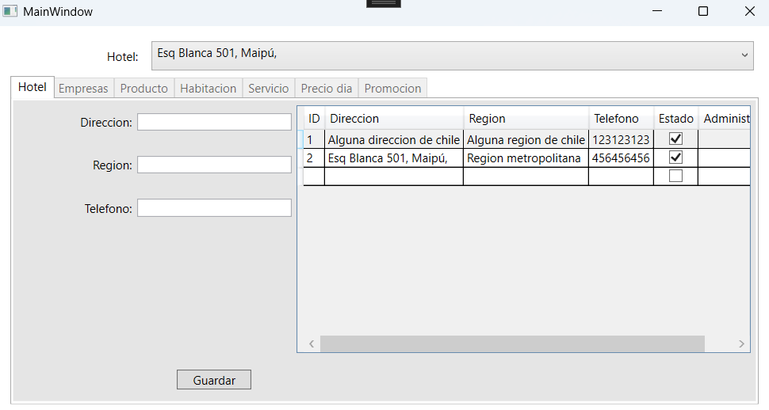

# Veranum

## Descripción

Proyecto realizado para una clase de integración de sistemas del instituto

El proyecto consiste en un sistema hotelero para la gestion de habitaciones, productos y servicios. Este cuenta con un servidor backend, una aplicacion web frontend y por ultimo una aplicacion de escritorio

### Base de datos

La base de datos utilizada fue MySql. Las instrucciones de configuracion de la base de datos la podemos encontrar en la ruta `./db`

### Backend

Creamos una API utilizando las siguientes herramientas

- Express
- BodyParser
- mysql2

La distribucion de archivos consta de 3 carpetas

1. **app**: Aqui se encuentra el middleware y el archivo que se encarga de las rutas
2. **bussines**: Aqui se encuentra la logica de negocio de la API
3. **dao**: Aqui se encuentra la conexion a base de datos y la conexion directa con la base de datos

### Frontend

Para construir la aplicacion web, utilizamos el framework Angular. Debido a los estandares de esta herramienta, esta consta con una estructura de carpetas predefinido, tests y el uso del lenguaje **typescript**

### Aplicacion de escritorio

Adicionalmente este cuenta con una aplicacion de escritorio utlizando el lenguaje C# y .net framework que permite la gestion de los hoteles, los productios y servicios de igual manera que la aplicacion web. Este realiza sus transacciones a travez de la API

## Integrantes

Este proyecto fue realizado en conjunto a 

- Andres Cubillos
- Jorge Corvalan
- Ignacio Donoso
- Rigoberto Manquel